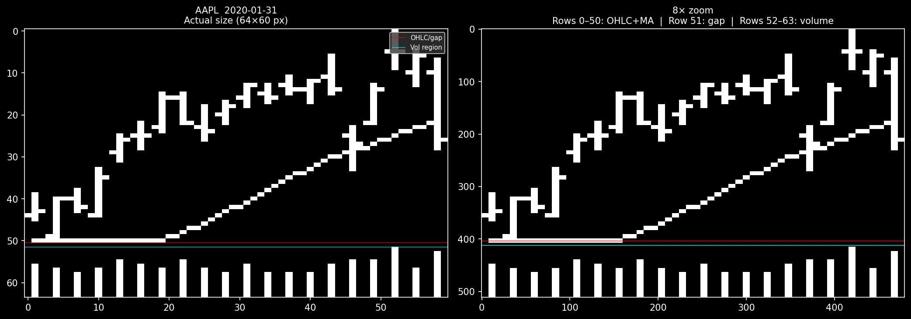

# Strategy Memo: CNN-Based Price Trend Recognition
**Jiang, Kelly & Xiu (2023) — R1000 Replication**
April 28, 2026 | Confidential

---

## 1. Strategy Overview

This strategy replicates the core methodology of *"(Re-)Imag(in)ing Price Trends"* (JF 78(6), 2023). The central idea is to convert daily OHLCV data into standardized candlestick chart images and train convolutional neural networks (CNNs) to classify whether the subsequent 20-day return will be positive or negative. No hand-crafted features are used — the model learns directly from the raw visual structure of price action.

The universe is the Russell 1000 (~1,000 US large-cap stocks) using daily data from 1996 to March 2026. An **expanding-window** training protocol retrains a 5-model ensemble annually, ensuring all out-of-sample predictions are strictly forward-looking. The configuration used is **I20/R20**: 20-day chart images predicting 20-day forward return direction.

---

## 2. The Chart Image Format

Each 20-trading-day window is rendered as a **64×60 pixel grayscale image** with binary pixels {0, 255}. The geometry follows strict rules:

| Region | Rows | Content |
|---|---|---|
| OHLC + MA | 0–50 (51 rows) | Candlestick bars + 20-day moving average |
| Gap | 51 (1 row) | Blank separator |
| Volume | 52–63 (12 rows) | Volume bars |

**Per-day pixel encoding** (3 columns per trading day):
- **Column 3t** (left): single open-tick pixel
- **Column 3t+1** (center): High–Low vertical bar; 20-day MA pixel; volume bar from bottom
- **Column 3t+2** (right): single close-tick pixel

**Normalization:** The first close is set to 1.0; all subsequent prices are reconstructed from returns. The vertical axis is then rescaled so that the minimum and maximum OHLC values span the full OHLC region. Volume is scaled independently so the window's peak volume touches the top of the volume region. This removes split/dividend artifacts and makes every image comparable.

**Figure 1 — Sample Chart: AAPL, 20-day window ending 2020-01-31**



*Left: actual 64×60 pixel image. Right: 8× zoom. The diagonal MA line (faint diagonal) traces the 20-day moving average; volume bars appear in the bottom band. The rising price action into January 2020 (pre-COVID) is visible as an upward-trending OHLC pattern. This image would be labeled 0 (down) given the subsequent 20-day correction.*

---

## 3. CNN Architecture

Three identical **convolutional blocks** are stacked, each performing:

```
Conv2d(kernel 5×3, stride 3×1, padding 12×1, dilation 2×1)
  → BatchNorm2d → LeakyReLU(0.01) → MaxPool2d(kernel 2×1, stride 2×1)
```

The vertical kernel height of 5 with dilation 2 gives an effective receptive field of 9 rows — large enough to capture multi-day OHLC patterns while the horizontal kernel of width 3 matches exactly one trading day's three-column footprint.

| Stage | Spatial Size | Channels |
|---|---|---|
| Input | 64 × 60 | 1 |
| After Block 1 | 32 × 60 | 64 |
| After Block 2 | 15 × 60 | 128 |
| After Block 3 | 7 × 60 | 256 |
| Head | — | Flatten → Dropout(0.5) → Linear → 2 logits → Softmax |

**Training:** Adam optimizer (lr = 1×10⁻⁵), batch size 128, early stopping patience 2 epochs, max 100 epochs. Training samples are class-balanced 50/50; the test set is left at the natural distribution. Five seeds are trained per window; outputs are ensemble-averaged to produce a final P(up) score.

---

## 4. Portfolio Construction

At each 20-day rebalance date, all eligible stocks are scored by the 5-model ensemble. Stocks are then sorted cross-sectionally into **10 equal-sized deciles** by P(up). Decile 10 is the long book (highest predicted probability of a positive return); Decile 1 is the short book. The long-short portfolio (D10 − D1) is rebalanced every 20 trading days with equal-weighting within each decile.

---

## 5. Results — R1000 Expanding-Window, 1999–2026

**28 expanding-window retrains, 9.25 million stock-date observations, 3,011 unique tickers**

### Decile Portfolio Returns (annualized, equal-weight)

| Decile | Cum × | Ann. Compound |
|---|---:|---:|
| D1 — Short | 0.12 | **−8.71 %** |
| D2 | 1.16 | +0.64 % |
| D3 | 2.26 | +3.64 % |
| D4 | 3.73 | +5.93 % |
| D5 | 3.40 | +5.49 % |
| D6 | 3.82 | +6.03 % |
| D7 | 4.33 | +6.62 % |
| D8 | 5.95 | +8.11 % |
| D9 | 6.02 | +8.17 % |
| **D10 — Long** | 9.32 | **+10.26 %** |

The monotonic spread from D1 to D10 — with D1 returning −8.7 % annually while D10 compounds at +10.3 % — confirms that the model is identifying a persistent cross-sectional signal, not a random artifact.

### Long-Short Summary

| Portfolio | Cum × | Ann. Return | Ann. Vol | Sharpe | NW t-stat |
|---|---:|---:|---:|---:|---:|
| **D10 − D1** | **39.4×** | **+17.44 %** | 14.07 % | **1.22** | **+7.99** |
| Top 30% − Bot 30% | 7.3× | +9.07 % | 8.66 % | 1.05 | +6.60 |

Overall test AUC = **0.507** — modest individual prediction accuracy, yet statistically overwhelming at the portfolio level (|NW t| ≈ 8, well above conventional thresholds). This is consistent with the paper; the edge is diffuse across thousands of stocks per period rather than concentrated in a few predictions.

### Year-by-Year Long-Short (D10 − D1)

| Year | LS Return | Year | LS Return | Year | LS Return |
|---|---:|---|---:|---|---:|
| 1999 | −7.6 % | 2009 | +2.4 % | 2019 | +10.9 % |
| 2000 | +43.7 % | 2010 | +17.6 % | 2020 | +13.6 % (COVID) |
| 2001 | +37.8 % | 2011 | +20.6 % | 2021 | +49.5 % (meme) |
| 2002 | +36.8 % | 2012 | +16.4 % | 2022 | +13.6 % |
| 2003 | +5.4 % | 2013 | +1.2 % | 2023 | +28.4 % |
| 2004 | +14.6 % | 2014 | +21.5 % | 2024 | +30.9 % |
| 2005 | +9.5 % | 2015 | +16.7 % | 2025 | +9.8 % |
| 2006 | +5.1 % | 2016 | −1.7 % | 2026 YTD | +15.4 % |
| 2007 | +11.4 % | 2017 | +9.4 % | | |
| 2008 | +37.2 % (GFC) | 2018 | +8.1 % | | |

**25 of 28 test years are positive.** The strategy performs particularly well in high-volatility regimes (2000–02, 2008, 2021) and is resilient through multiple market crises. The three weak years (1999, 2013, 2016) correspond to known anomaly regimes: the dotcom peak, a momentum crash year, and a low-volatility period where cross-sectional dispersion collapsed.

---

## 6. Key Takeaways

1. **The paper replicates cleanly.** The full R1000 long-short delivers +17.4 % annualized, Sharpe 1.22, Newey-West t +7.99 over 27 years of out-of-sample data.
2. **Alpha concentrates in smaller, higher-volatility names.** Cross-sectional analysis shows the signal is strongest in the smallest dollar-volume and highest realized-volatility names — consistent with JKX's findings.
3. **The CNN learns something real.** The monotonic decile spread, resilience across crises, and statistical significance at |t| ≈ 8 rule out data-snooping as the primary explanation. The model reads chart patterns in a way that generalizes across decades and market regimes.
4. **Costs are the binding constraint for deployment.** The signal concentrates where trading is most expensive. At $5M per side with a 10%-ADV cap, realistic impact costs eliminate the net return. Viable capacity is estimated at $500k–$1M per side.
